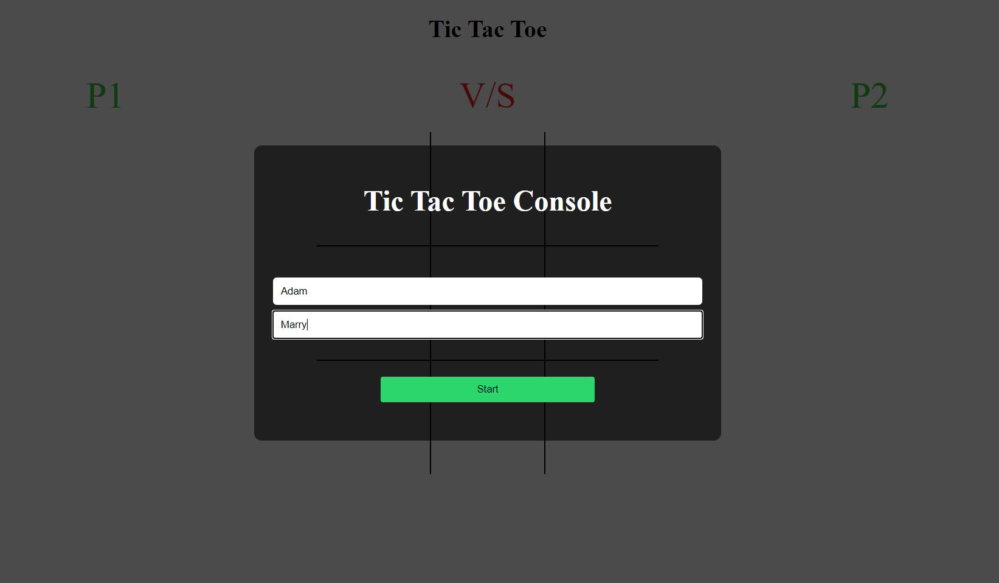
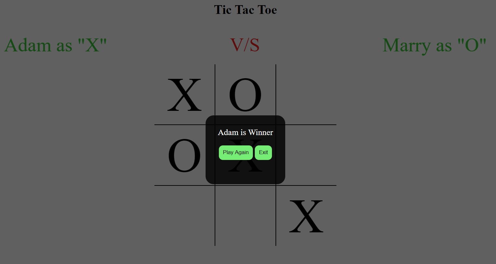
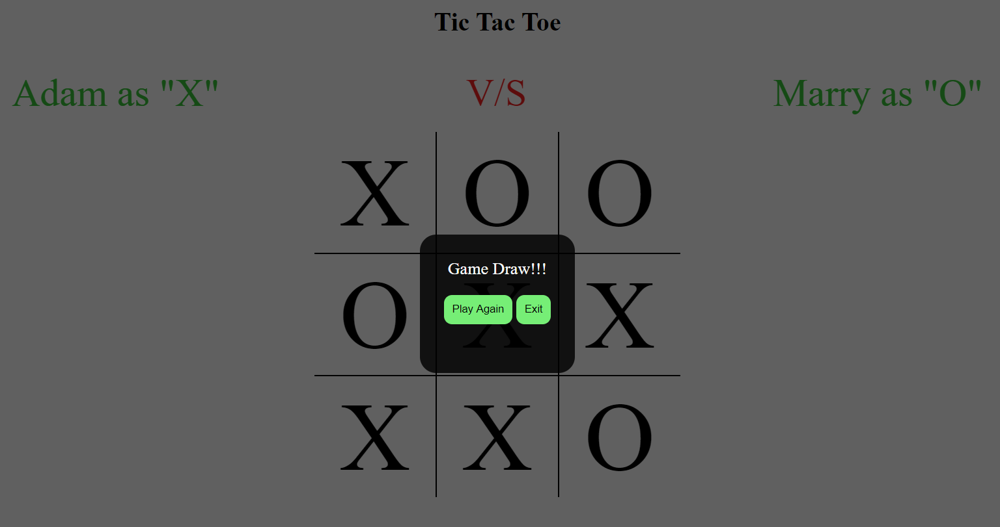

# Tic Tac Toe - Using Javascript

This Project follows the lesson about Factory Functions and The Module Pattern so the main goal is to put into practice those concepts along with the main concepts of Object Oriented Programming. Particularly, classes/objects and how to access their methods and attributes..

## Built With

- Javascript

## Live Demo

- [Live Demo Link](https://rawcdn.githack.com/rajkumardas2701/TicTacToe_JS/c93694f7b1eca2bcdbd732d026ba644a06310fd1/index.html)

## Getting Started

To get a local copy up and running follow these simple example steps.

### Prerequisites

1. Have latest version of JS installed.
2. Install the latest version of your browser of choice.

### Setup

1. Clone this repo to your computer using <code>git clone</code>
2. Open index.html file on the local Live server to run the app.

## Authors

👤 **Rajkumar Das**

- Github: [@rajkumardas2701](https://github.com/rajkumardas2701)
- Twitter: [@Rajkuma58621299](https://twitter.com/Rajkuma58621299)
- Linkedin: [Rajkumar Das](https://www.linkedin.com/in/rajkumar-das-41308961/)

## 🤝 Contributing

Contributions, issues and feature requests are welcome!

Feel free to check the [issues page](https://github.com/rajkumardas2701/TicTacToe_JS/issues).

## Show your support

Give a ⭐️ if you like this project!

## Acknowledgments

Referred Odin project to learn about ES6

## 📝 License

This project is [MIT](lic.url) licensed.
